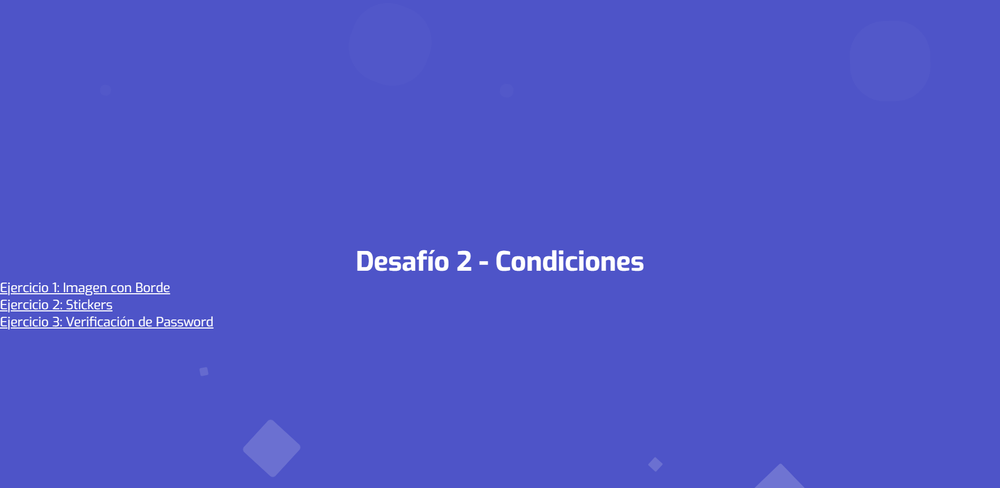

# Desafío 2 - Condiciones

Este proyecto corresponde al desafío de la unidad de **Condiciones** en JavaScript para Desafío Latam.

## 📄 Contenido
- **index.html**: Página principal con enlaces a los ejercicios.
- **ejercicio1.html**: Modificación de imagen aplicando un borde al hacer clic.
- **ejercicio2.html**: Selección y validación de cantidad de stickers.
- **ejercicio3.html**: Verificación de password utilizando selectores.
- **style.css**: Estilos animados para fondo y diseño general del proyecto.

## 🚀 Tecnologías utilizadas
- HTML5
- CSS3 (animaciones y responsive design)
- JavaScript (DOM, condicionales if/else)

## 🎯 Instrucciones para ejecutar
1. Clonar o descargar este repositorio.
2. Abrir el archivo `index.html` en el navegador.
3. Navegar a los ejercicios desde el menú principal.

## 🌐 Visual
El diseño cuenta con un fondo animado (burbujas flotantes) y una fuente moderna proporcionada por Google Fonts (`Exo`).

## 📷 Vista previa

## 🔗 Demo en GitHub Pages
Ejemplo: https://wiimri.github.io/jscondiciones/

---

> Proyecto desarrollado para fines educativos y prácticos.
